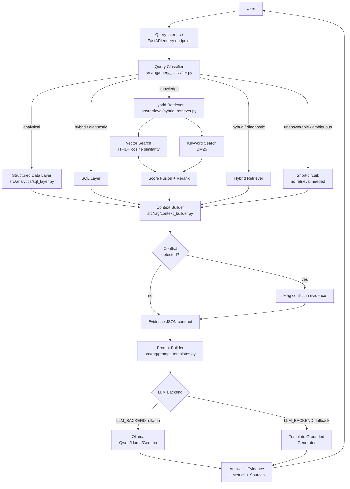

# Architecture

> Note: the assignment's deliverable list asks for `docs/architecture.png`.
> This sandbox has no image-rendering toolchain wired up for architecture
> diagrams, so this is a Mermaid diagram in Markdown instead (renders
> natively on GitHub/GitLab, and `docs/evaluation.md` has the eval numbers
> a PNG summary would otherwise show). If a static image is required for
> submission, this Mermaid block can be exported to PNG in ~10 seconds via
> the Mermaid CLI (`mmdc -i architecture.md -o architecture.png`) or
> mermaid.live.

## End-to-end flow

## Component responsibilities

| Component | File | Responsibility |
|---|---|---|
| Data generator | `src/ingestion/data_generator.py` | Synthesizes the 5-entity SQLite warehouse |
| Document loader | `src/ingestion/document_loader.py` | Loads, cleans, chunks markdown KB docs |
| Embedder | `src/retrieval/embeddings.py` | Pluggable TF-IDF / neural vectorizer |
| Vector store | `src/retrieval/vector_store.py` | Fit, persist, cosine-similarity search |
| Keyword index | `src/retrieval/keyword_search.py` | BM25 lexical search |
| Hybrid retriever | `src/retrieval/hybrid_retriever.py` | Fusion + lightweight rerank + metadata filters |
| Query classifier | `src/rag/query_classifier.py` | Routes to knowledge/analytical/hybrid/diagnostic/unanswerable/ambiguous |
| SQL layer | `src/analytics/sql_layer.py` | Parametrized, reviewed metric queries (no free-form generated SQL) |
| Context builder | `src/rag/context_builder.py` | Fuses SQL + retrieval results into one evidence contract; detects conflicts |
| Prompt templates | `src/rag/prompt_templates.py` | System instruction + structured evidence prompt |
| LLM factory | `src/llm/factory.py`, `base.py`, `ollama_client.py`, `fallback_llm.py` | Pluggable generation backend |
| Pipeline orchestrator | `src/rag/pipeline.py` | Wires everything together, owns latency instrumentation |
| API | `src/api/main.py`, `schemas.py` | FastAPI endpoints |
| Evaluation | `src/evaluation/eval_runner.py`, `test_cases.json` | 38-case eval harness |
| UI | `ui/streamlit_app.py` | Dashboard, assistant, evidence panel, document management |

## Why this shape

The single most important design decision is that **the evidence contract
(a JSON dict) is the interface between retrieval/analytics and generation**,
and both LLM backends (real Ollama model, deterministic fallback) consume
exactly that same contract. This means:

1. Swapping `LLM_BACKEND` between `ollama` and `fallback` never requires
   touching retrieval, analytics, or routing code.
2. The fallback generator is trivially auditable — it can only render values
   that are literally present in the evidence dict, so a demo/CI run never
   risks silently fabricating a number even without a real LLM available.
3. It sets up cleanly for LLM-as-judge evaluation later: an evaluator can
   diff "does the answer text contain only values traceable to this JSON"
   without needing to re-run retrieval.
